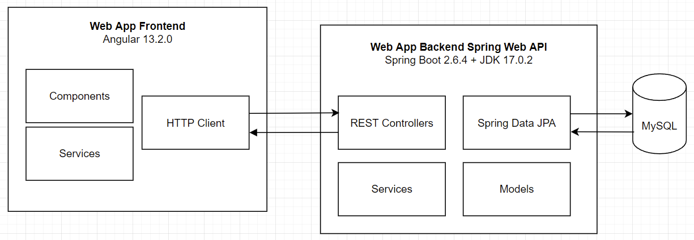
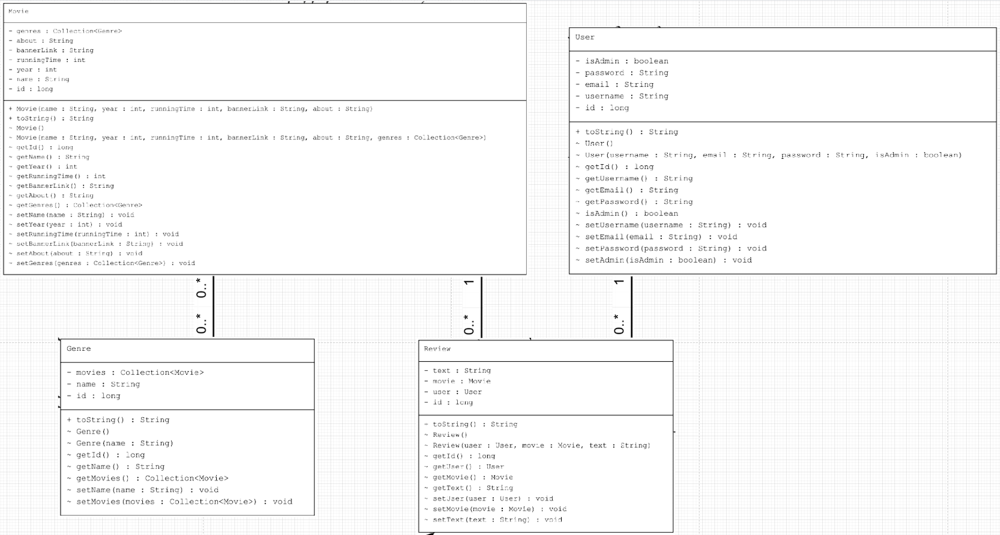
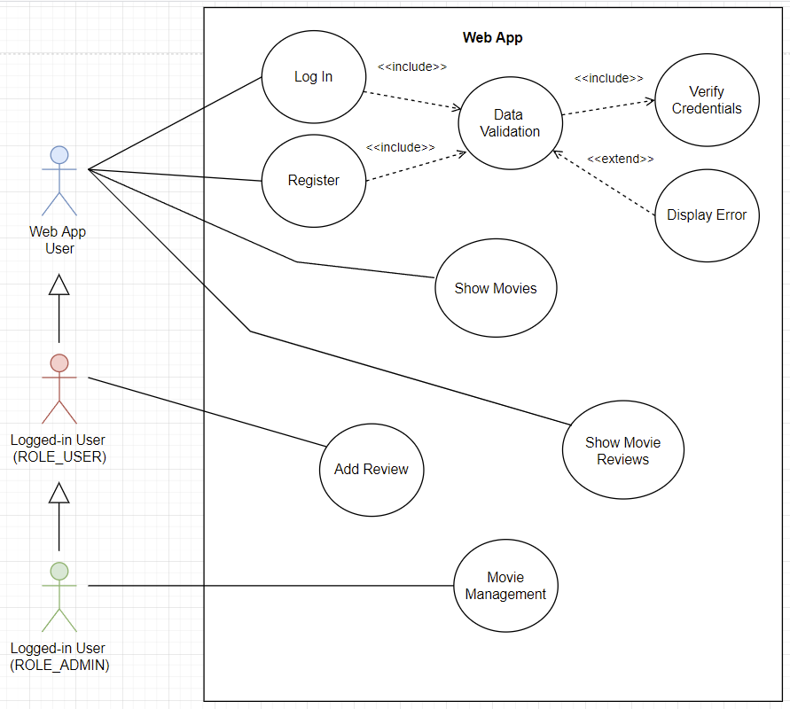
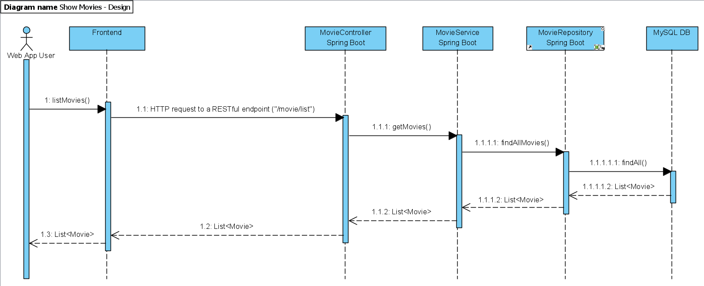

# 7SWI1 Projekt
### -- Téma: webová stránka, na které se mohou dávat různým filmům recenze (viz. ČSFD)
### -- Nepřihlášení uživatelé mohou koukat na filmy a jejich recenze, přihlášení uživatelé mohou psát svoje recenze filmu
### -- Adminové mohou přidat do systému nový film
### -- backend: Spring Boot REST
### -- frontend: Angular

## SWOT

## Database scheme:

## Architecture Diagram:

## Class Diagram:
- [Genre](diagrams/class/classes/genre.png)

- [Movie](diagrams/class/classes/movie.png)

- [Review](diagrams/class/classes/review.png)

- [User](diagrams/class/classes/user.png)

## Use Case:
- [Use Case Scenarios](diagrams/web_app_scenarios.pdf)

## Analytical Sequence Diagram:

## Design Sequence Diagram:

